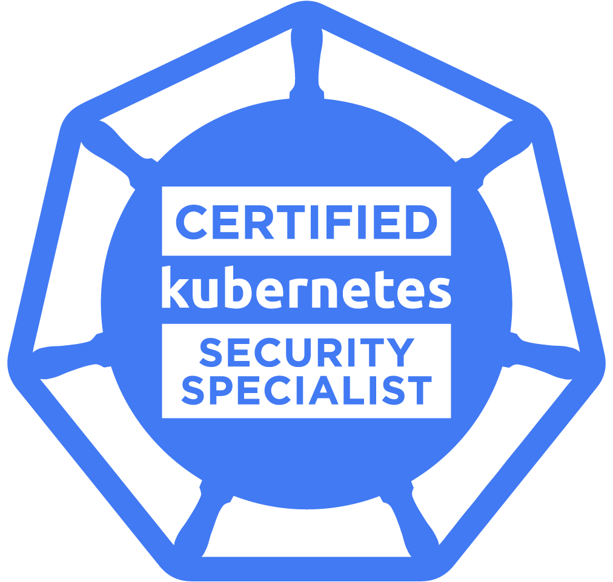

[](http://makeapullrequest.com)

# SIGHUP Training Exercises

<p align="center">
  
  
  
</p>

A curated collection of exercises to prepare you as Kubernetes black belt!
With this exercise and demos you will have a good understanding and implementation of Kubernetes eco-system. What matters is that you enjoy the learning process.

<!-- ABOUT THE REPO -->
## About The Repo

This repository will contain a list of hands-on exercises and demos for you to attempt and up skill yourself. 

## :small_blue_diamond: 1. Cluster Setup
Curated list of local Kubernetes Clusters
#### Kind

<details>
<summary>Quickstart - Read more</summary>
<br>

```bash
cd cluster-setup/kind
make kind
```

More information about the setup can be found [here](kind/).

More information about [Kind](https://kind.sigs.k8s.io/docs/user/quick-start/).

</details>
<br>

- [ ] [Play with Kind](cluster-setup/kind)

#### Minikube
<details>
<summary>Quickstart - Read more</summary>
<br>

```bash
cd cluster-setup/minikube
make minikube   
```

More information about the setup can be found [here](minikube/).

More information about [Minikube](https://minikube.sigs.k8s.io/docs/start/).

</details>
<br>

- [X] [Play with Minikube](cluster-setup/minikube)

#### Vagrant
<details>
<summary>Quickstart - Read more</summary>
<br>

```bash
cd cluster-setup/vagrant
make vagrant
```

More information about the setup can be found [here](vagrant/).

More information about [Vagrant](https://learn.hashicorp.com/collections/vagrant/getting-started).

</details>
<br>

- [X] [Play with Minikube](cluster-setup/minikube)

#### Free Kubernetes Online Environment
- [Killer Coda](https://killercoda.com/playgrounds)

## :small_blue_diamond: 2. Exercises
Learning Kubernetes can seem challenging. But fear not! Here's a curated list of delightful set of hands-on labs that covers from the Fundamentals to Certified!

#### :large_orange_diamond: Demos
This type of exercises will guide you step by step in understanding the various aspects of the technologies.

##### &nbsp;&nbsp;&nbsp;&nbsp;&nbsp;&nbsp;  :white_circle: Docker
- [X] [PowerApp by SIGHUP](exercises/demos/docker)
##### &nbsp;&nbsp;&nbsp;&nbsp;&nbsp;&nbsp; :white_circle: Kubernetes
- [X] [Play with cluster](exercises/demos/kubernetes/play-with-cluster)
- [X] [Deployments](exercises/demos/kubernetes/deployments)
- [X] [ConfigMaps](exercises/demos/kubernetes/configmaps)
- [X] [Secrets](exercises/demos/kubernetes/secrets)
- [X] [Jobs](exercises/demos/kubernetes/jobs)
- [ ] [Services](exercises/demos/kubernetes/services)
- [X] [Storage](exercises/demos/kubernetes/volumes)
- [X] [Multi Tier App](exercises/demos/kubernetes/power-app)
- [X] [RBAC](exercises/demos/kubernetes/rbac)
- [X] [Kustomize](exercises/demos/kubernetes/kustomize)
- [X] [Kustomize multi Env](exercises/demos/kubernetes/kustomize-multi-env)
- [X] [Helm](exercises/demos/kubernetes/helm)
- [X] [Etcd](exercises/demos/kubernetes/etcd)
- [X] [CRD](exercises/demos/kubernetes/crd)
- [X] [Debug and Troubleshooting](exercises/demos/kubernetes/debug-troubleshooting)
- [X] [Jenkins Kaniko Kustomize](exercises/demos/kubernetes/jenkins-kaniko-kustomize)
- [X] [ArgoCD with Helm](exercises/demos/kubernetes/argocd-helm)
- [X] [Logging](exercises/demos/kubernetes/logging)
- [ ] [Monitoring](exercises/demos/kubernetes/monitoring)
#### :large_orange_diamond: Skill Tests
Test your ability to work with real hands-on kubernetes mock exam exercises. Let's do practice tests with solutions, tips and advice.

##### &nbsp;&nbsp;&nbsp;&nbsp;&nbsp;&nbsp;  :white_circle: CKA
- [ ] [Exercises](exercises/skill-tests/cka)
##### &nbsp;&nbsp;&nbsp;&nbsp;&nbsp;&nbsp; :white_circle: CKAD
- [ ] [Exercises](exercises/skill-tests/ckad)
##### &nbsp;&nbsp;&nbsp;&nbsp;&nbsp;&nbsp;  :white_circle: CKS
- [ ] [Exercises](exercises/skill-tests/cks)
##### &nbsp;&nbsp;&nbsp;&nbsp;&nbsp;&nbsp; :white_circle: GENERICS
- [X] [Helm](exercises/skill-tests/generics/helm)
- [X] [Kustomize](exercises/skill-tests/generics/kustomize)

<br>

> ⚠️ **This repo is still quite new and we are working on adding as many learning resources and projects as possible, so please do bear with us**