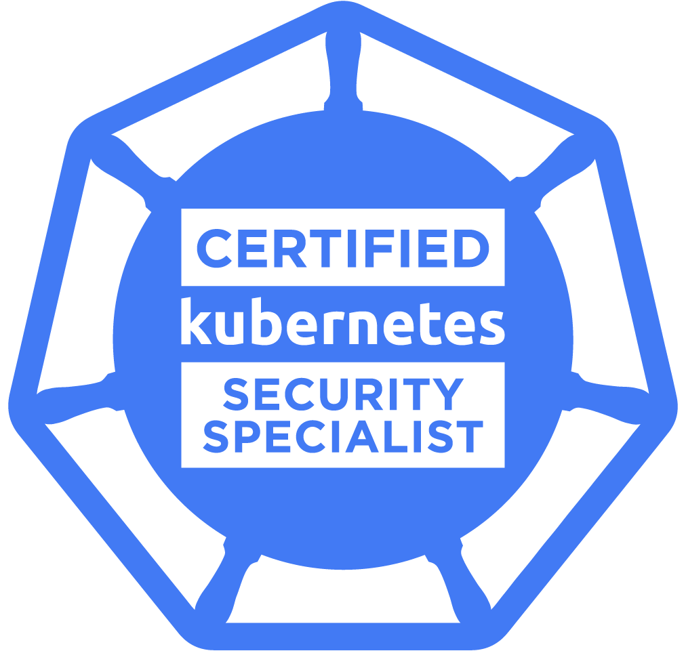

## Welcome to the **`Kubernetes Security Workshop`** ☸ ☁️ 🔐

   
  

## About The Repo

This repository will contain a list of hands-on exercises in order to follow along with the Workshop.

___

## Requirements

In order to procede with the tutorial in a local environment, you need the following tools:  

- [Docker](https://www.docker.com/)
- [Minikube](https://minikube.sigs.k8s.io/docs/start/)
- [Kubectl](https://kubernetes.io/docs/tasks/tools/)
- [Helm](https://helm.sh/docs/intro/install/)

## Hands On
In this tutorial we will implement a CI/CD pipeline with the appropriate security controls embedded in it.

* [First Steps in the Cloud(s)](hands-on/01-first-steps.md)
* [K8S Access](hands-on/02-k8s-access.md)
* [CIS Benchmarks](hands-on/03-cis-benchmarks.md)
* [Authentication and RBAC](hands-on/04-rbac.md)
* [Networking](hands-on/05-networking.md)
* [Gatekeeper](hands-on/06-gatekeeper.md)
* [Secrets management](hands-on/07-secrets-management.md)
* [Owasp Top 10](hands-on/08-owasp-top-10.md)
