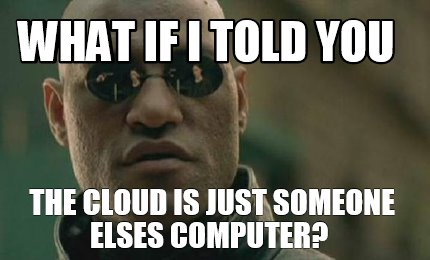

# FIRST STEPS IN THE CLOUD

Before we begin, a brief recap of the `Cloud Native` world.  
 
What is the Cloud? 
The Cloud is a new IT paradigm.
 
Basically it focuses on reducing the operative burden of managing infrastructure by outsurcing it.

When we talk about **cloud native** we mean applications and flows that leverage this paradigm.

As we have seen before, [Kubernetes](https://kubernetes.io/)(*k8s*) is considered the *De Facto* "Operative system" of the Cloud.  
For this tutorial we are going to connect (via `ssh`) to a remote **Kubernetes** cluster.

 

Continue to [Accessing the Cluster](02-k8s-access.md).
