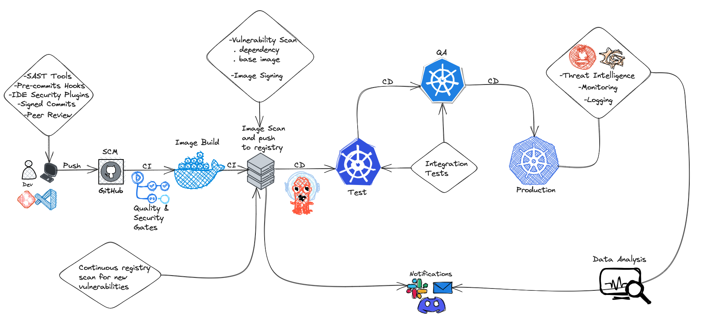

# CI/CD Pipelines

In software engineering, CI/CD is the combined practices of continuous integration (CI)  
and continuous delivery (CD) or, less often, continuous deployment.  
They are sometimes referred to collectively as continuous development or continuous software development.  

 

By automating CI/CD throughout development, testing, production, and monitoring phases of the software development lifecycle  
organizations are able to develop higher quality code, faster.  
Although it’s possible to manually execute each of the steps of a CI/CD pipeline, the true value of CI/CD pipelines is realized through automation.

 

This repo contains a working implementation of a [tekton](https://tekton.dev/) pipeline.  
`Tekton` is a cloud native framework for crafting CI/CD pipelines.  
Once again, for cloud native we mean that it runs on Kubernetes.  

In Tekton, every task that makes up a pipeline runs in a separate kubernetes pod.

 

We implement a tekton pipeline that does the following:
1. *clone* a public git repository
2. does *linting* against the *Makefile*
3. does *linting* against the *README*
4. *SAST* analysis to search for *hardcoded secrets* (api keys, tokens, passwords) in the repository
5. does *linting* against the python code
6. executes a python *unit test*
7. does *linting* and *OPA Conftest* rules checking against the *dockerfile*
8. does *linting* and *OPA Conftest* rules checking against the *helm/k8s manifests*
9. *build* the *OCI image*
10. *scan* the builded image for vulnerabilities
11. push the scanned image to a *remote 'production' docker registry*
12. *sign* the image via a custom *cosign* task (this can also be done via <a href="https://tekton.dev/docs/chains/">tekton chains</a>)
13. *deploy* the application via *helm* on the local K8s cluster

Some tasks (eg. the linting and testing ones) are run in parallel to speed up the pipeline execution.  
In a real world scenario it is recommended to execute some tasks (eg. SAST, linting) via [pre-commit hooks](https://pre-commit.com/).  

Here is an high-level example on how a secure pipeline looks like:
  

**Note**: this repository is intended as a demo on a disposable local development environment, this is not suitable for production.

 

Continue to [Get your hands dirty](03-get-your-hands-dirty.md)
