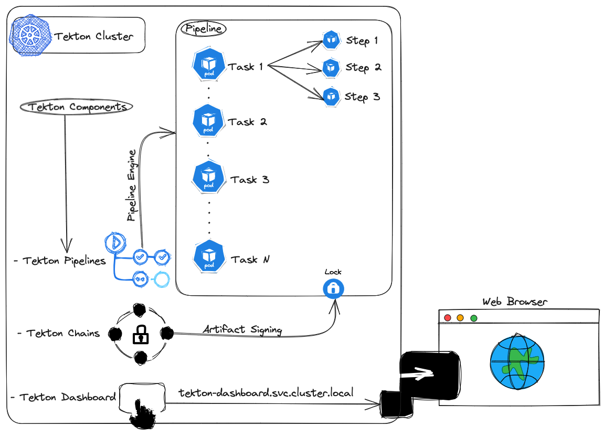

# TEKTON

As previously stated, `Tekton` is a `cloud native CI/CD Framework`.  
Tekton is made up of several [components](https://tekton.dev/docs/concepts/overview/#what-are-the-components-of-tekton) that can also be installed individually.  
For this demo we will install *tekton pipelines* (the tekton core), *tekton chains* and *tekton dashboard*.  

This is what tekton architecture will look like in our cluster:  


Run the following command to install Tekton components:  
```console
echo  "<INSTALLING TEKTON PIPELINES>" \
&& kubectl apply -f https://storage.googleapis.com/tekton-releases/pipeline/latest/release.yaml \
&& echo  "<INSTALLING TEKTON DASHBOARD>" \
&& kubectl apply -f https://storage.googleapis.com/tekton-releases/dashboard/latest/release-full.yaml \
&& echo  "<INSTALLING TEKTON CHAINS>" \
&& kubectl apply --filename https://storage.googleapis.com/tekton-releases/chains/latest/release.yaml
```  

Output:  
```console
<INSTALLING TEKTON PIPELINES>
namespace/tekton-pipelines created
clusterrole.rbac.authorization.k8s.io/tekton-pipelines-controller-cluster-access created
clusterrole.rbac.authorization.k8s.io/tekton-pipelines-controller-tenant-access created
clusterrole.rbac.authorization.k8s.io/tekton-pipelines-webhook-cluster-access created
role.rbac.authorization.k8s.io/tekton-pipelines-controller created
role.rbac.authorization.k8s.io/tekton-pipelines-webhook created
role.rbac.authorization.k8s.io/tekton-pipelines-leader-election created
role.rbac.authorization.k8s.io/tekton-pipelines-info created
serviceaccount/tekton-pipelines-controller created
serviceaccount/tekton-pipelines-webhook created
clusterrolebinding.rbac.authorization.k8s.io/tekton-pipelines-controller-cluster-access created
clusterrolebinding.rbac.authorization.k8s.io/tekton-pipelines-controller-tenant-access created
clusterrolebinding.rbac.authorization.k8s.io/tekton-pipelines-webhook-cluster-access created
rolebinding.rbac.authorization.k8s.io/tekton-pipelines-controller created
rolebinding.rbac.authorization.k8s.io/tekton-pipelines-webhook created
rolebinding.rbac.authorization.k8s.io/tekton-pipelines-controller-leaderelection created
rolebinding.rbac.authorization.k8s.io/tekton-pipelines-webhook-leaderelection created
rolebinding.rbac.authorization.k8s.io/tekton-pipelines-info created
customresourcedefinition.apiextensions.k8s.io/clustertasks.tekton.dev created
customresourcedefinition.apiextensions.k8s.io/customruns.tekton.dev created
customresourcedefinition.apiextensions.k8s.io/pipelines.tekton.dev created
customresourcedefinition.apiextensions.k8s.io/pipelineruns.tekton.dev created
customresourcedefinition.apiextensions.k8s.io/resolutionrequests.resolution.tekton.dev created
customresourcedefinition.apiextensions.k8s.io/tasks.tekton.dev created
customresourcedefinition.apiextensions.k8s.io/taskruns.tekton.dev created
customresourcedefinition.apiextensions.k8s.io/verificationpolicies.tekton.dev created
secret/webhook-certs created
validatingwebhookconfiguration.admissionregistration.k8s.io/validation.webhook.pipeline.tekton.dev created
mutatingwebhookconfiguration.admissionregistration.k8s.io/webhook.pipeline.tekton.dev created
validatingwebhookconfiguration.admissionregistration.k8s.io/config.webhook.pipeline.tekton.dev created
clusterrole.rbac.authorization.k8s.io/tekton-aggregate-edit created
clusterrole.rbac.authorization.k8s.io/tekton-aggregate-view created
configmap/config-defaults created
configmap/feature-flags created
configmap/pipelines-info created
configmap/config-leader-election created
configmap/config-logging created
configmap/config-observability created
configmap/config-registry-cert created
configmap/config-spire created
deployment.apps/tekton-pipelines-controller created
service/tekton-pipelines-controller created
namespace/tekton-pipelines-resolvers created
clusterrole.rbac.authorization.k8s.io/tekton-pipelines-resolvers-resolution-request-updates created
role.rbac.authorization.k8s.io/tekton-pipelines-resolvers-namespace-rbac created
serviceaccount/tekton-pipelines-resolvers created
clusterrolebinding.rbac.authorization.k8s.io/tekton-pipelines-resolvers created
rolebinding.rbac.authorization.k8s.io/tekton-pipelines-resolvers-namespace-rbac created
configmap/bundleresolver-config created
configmap/cluster-resolver-config created
configmap/resolvers-feature-flags created
configmap/config-leader-election created
configmap/config-logging created
configmap/config-observability created
configmap/git-resolver-config created
configmap/hubresolver-config created
deployment.apps/tekton-pipelines-remote-resolvers created
horizontalpodautoscaler.autoscaling/tekton-pipelines-webhook created
deployment.apps/tekton-pipelines-webhook created
service/tekton-pipelines-webhook created
<INSTALLING TEKTON DASHBOARD>
namespace/tekton-dashboard created
customresourcedefinition.apiextensions.k8s.io/extensions.dashboard.tekton.dev created
serviceaccount/tekton-dashboard created
role.rbac.authorization.k8s.io/tekton-dashboard-info created
clusterrole.rbac.authorization.k8s.io/tekton-dashboard-backend created
clusterrole.rbac.authorization.k8s.io/tekton-dashboard-tenant created
rolebinding.rbac.authorization.k8s.io/tekton-dashboard-info created
clusterrolebinding.rbac.authorization.k8s.io/tekton-dashboard-backend created
configmap/dashboard-info created
service/tekton-dashboard created
deployment.apps/tekton-dashboard created
clusterrolebinding.rbac.authorization.k8s.io/tekton-dashboard-tenant created
<INSTALLING TEKTON CHAINS>
namespace/tekton-chains created
secret/signing-secrets created
configmap/chains-config created
deployment.apps/tekton-chains-controller created
clusterrolebinding.rbac.authorization.k8s.io/tekton-chains-controller-cluster-access created
clusterrole.rbac.authorization.k8s.io/tekton-chains-controller-cluster-access created
clusterrole.rbac.authorization.k8s.io/tekton-chains-controller-tenant-access created
clusterrolebinding.rbac.authorization.k8s.io/tekton-chains-controller-tenant-access created
serviceaccount/tekton-chains-controller created
role.rbac.authorization.k8s.io/tekton-chains-leader-election created
rolebinding.rbac.authorization.k8s.io/tekton-chains-controller-leaderelection created
role.rbac.authorization.k8s.io/tekton-chains-info created
rolebinding.rbac.authorization.k8s.io/tekton-chains-info created
configmap/chains-info created
configmap/config-logging created
```  

Retrieve all the installed Tekton's custom resource definitions:  
```console
kubectl get crds

NAME                                       CREATED AT
clustertasks.tekton.dev                    2024-01-30T13:21:37Z
customruns.tekton.dev                      2024-01-30T13:21:37Z
extensions.dashboard.tekton.dev            2024-01-30T13:21:39Z
pipelineruns.tekton.dev                    2024-01-30T13:21:37Z
pipelines.tekton.dev                       2024-01-30T13:21:37Z
resolutionrequests.resolution.tekton.dev   2024-01-30T13:21:37Z
stepactions.tekton.dev                     2024-01-30T13:21:37Z
taskruns.tekton.dev                        2024-01-30T13:21:37Z
tasks.tekton.dev                           2024-01-30T13:21:37Z
verificationpolicies.tekton.dev            2024-01-30T13:21:37Z
```  


Continue to [Tekton Tasks](05-tekton-tasks.md)

