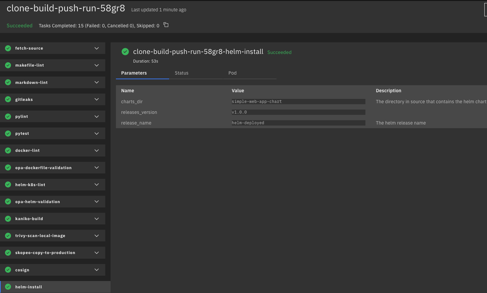
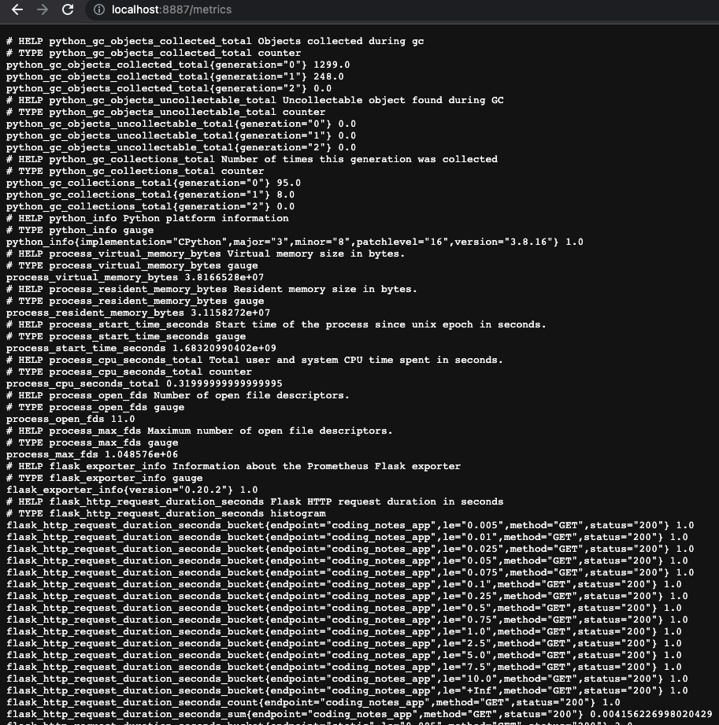
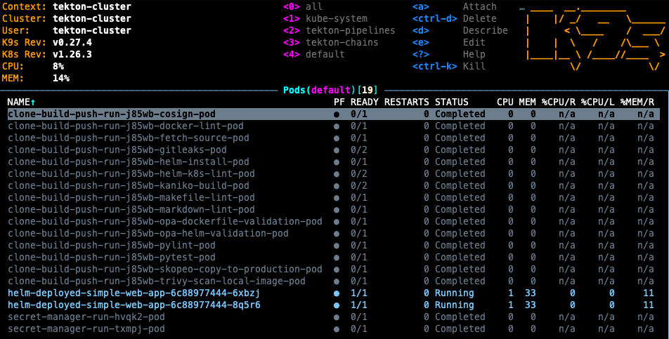
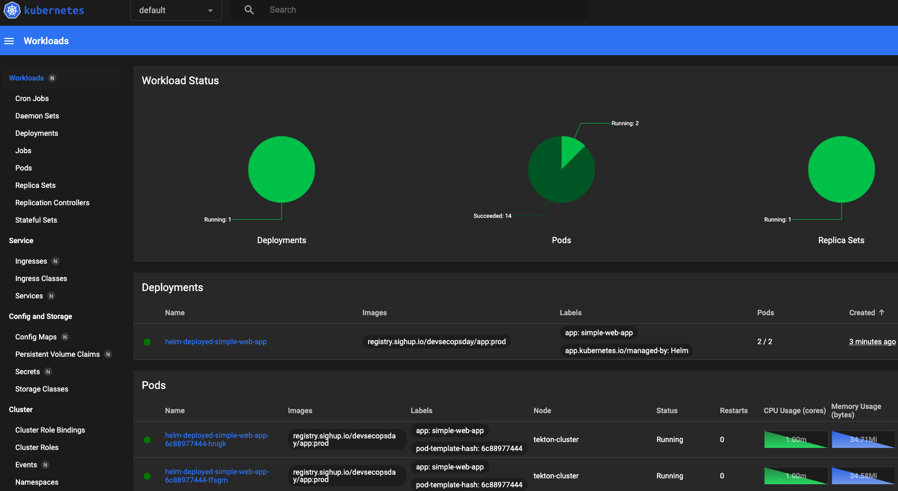

# RESULTS

We are going to inspect the pipeline log from the dashboard, just run:
```console
kubectl port-forward -n tekton-pipelines service/tekton-dashboard 9097:9097
```
and then open a browser to http://localhost:9097.  

> **Note**
>  If you are following the containerday workshop on site (aws infrastructure) in order to expose the dashboard  
> you need to edit the service/tekton-dashboard into a NodePort service.

After a few minutes, our pipeline has terminated successfully:


We can prove this by exposing the application service on minikube:
```console
minikube --profile tekton-cluster service helm-deployed-service
```

This command should open your browser... et voilà! 🔥🔥🔥
  

  

The app also expose [prometheus](https://prometheus.io/) metrics at the `/metrics` endpoint:  

  


If you want you can also inspect the deployed resources on our cluster via *CLI* with `kubectl` or [k9s](https://github.com/derailed/k9s):  


  
The above image shows all the completed pipeline's tasks and also the two pods that make up our app deployment.  


Alternatively, if you prefer to use a *GUI*, you can use [lens](https://k8slens.dev/) or  `minikube dashboard`:

```console
minikube --profile tekton-cluster dashboard --url

🔌  Enabling dashboard ...
    ▪ Using image docker.io/kubernetesui/dashboard:v2.7.0
    ▪ Using image docker.io/kubernetesui/metrics-scraper:v1.0.8
💡  Some dashboard features require the metrics-server addon. To enable all features please run:

        minikube -p tekton-cluster addons enable metrics-server


🤔  Verifying dashboard health ...
🚀  Launching proxy ...
🤔  Verifying proxy health ...
http://127.0.0.1:65129/api/v1/namespaces/kubernetes-dashboard/services/http:kubernetes-dashboard:/proxy/
```



<br/>

What if we want to check the signature of our image?  
Simple, once again we can use *cosign*.  
Make sure that your local docker agent can log in to the registry that we are using for this demo: `registry.sighup.io`

Now simply run:

```console
cosign verify --key k8s://tekton-chains/signing-secrets registry.sighup.io/workshop/app:prod
```

Output:
```console
Verification for registry.sighup.io/workshop/app:prod --
The following checks were performed on each of these signatures:
  - The cosign claims were validated
  - Existence of the claims in the transparency log was verified offline
  - The signatures were verified against the specified public key

[{"critical":{"identity":{"docker-reference":"registry.sighup.io/devsecopsday/app"},"image":{"docker-manifest-digest":"sha256:3fb4de9567a165c2d8b4683241c0fcd4724d83ff98448bf1c23541461027b545"},"type":"cosign container image signature"},"optional":{"Bundle":{"SignedEntryTimestamp":"MEYCIQDotPkS0S6zXSLve5j2wRQmOC/K80u4Qqbb7C2Td8ryIwIhAJJQojIVOdRIMOXvCxSgIolbkJcKl7iTqL4/SToh6c4Y","Payload":{"body":"eyJhcGlWZXJzaW9uIjoiMC4wLjEiLCJraW5kIjoiaGFzaGVkcmVrb3JkIiwic3BlYyI6eyJkYXRhIjp7Imhhc2giOnsiYWxnb3JpdGhtIjoic2hhMjU2IiwidmFsdWUiOiI5YzU2MzQyMmNiZGE1YjAxMWY1OTQ5ZjQyNTEzOTcxNjQyYTA5ZGE5ZWQwODZjNjVkMGNlMDE0N2EyMWQ5MGY0In19LCJzaWduYXR1cmUiOnsiY29udGVudCI6Ik1FVUNJQVlIa3cyMXZEclFDS0pZZzBobVM2NmJiL1JMblZlVk01TGxIRTJQSWxzSkFpRUE3KzdlbVN1T0hhTzBKMFJZblZuQXNXc1pQQ1RCRHplQ25NODhNUDZoRWNNPSIsInB1YmxpY0tleSI6eyJjb250ZW50IjoiTFMwdExTMUNSVWRKVGlCUVZVSk1TVU1nUzBWWkxTMHRMUzBLVFVacmQwVjNXVWhMYjFwSmVtb3dRMEZSV1VsTGIxcEplbW93UkVGUlkwUlJaMEZGYUd3NE5FVlRNMFpWU2pOMWJrcHZObXBVZFdzMFpGcHNiMmRCYkFwYVEwcEpWa1JZUmtsNGREWkhNMHBaT0hoSWNURTNXbVZTVVdOSmQzQnNXVWROWnk5RGRWZGhiMUJwWmpWek4wbENXR2RNWlRkVlpXTjNQVDBLTFMwdExTMUZUa1FnVUZWQ1RFbERJRXRGV1MwdExTMHRDZz09In19fX0=","integratedTime":1684165972,"logIndex":20673557,"logID":"c0d23d6ad406973f9559f3ba2d1ca01f84147d8ffc5b8445c224f98b9591801d"}}}}]
```

<br/>

Continue to [Secret Manager](10-secret-manager.md)
