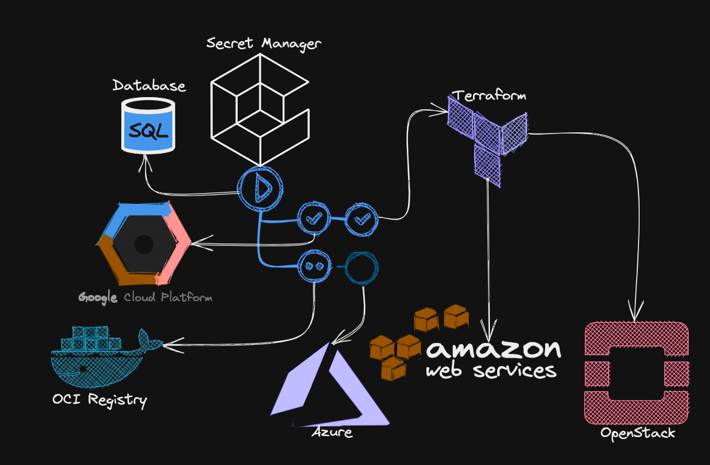
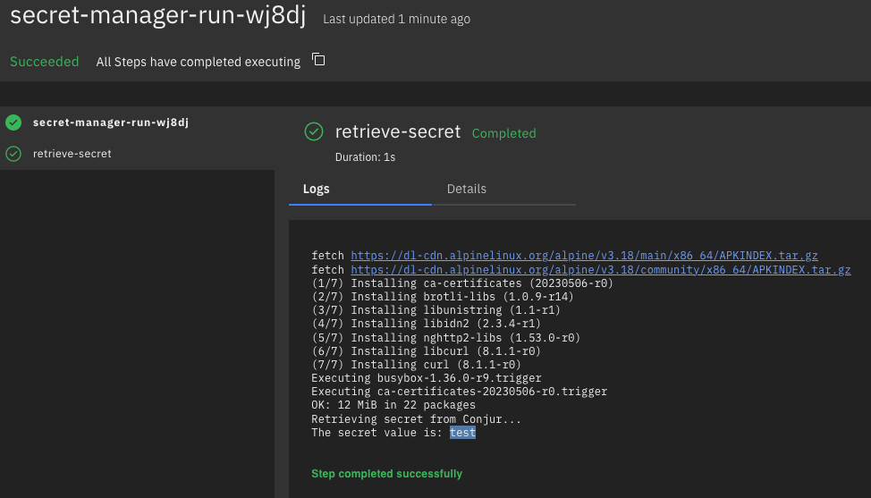

# SECRET MANAGER


it is necessary to dedicate a session to `secret manager` as fundamental component of a supply chain  
(along with the OCI image registry, already seen with the pipeline).  

Secret Manager allows you to store, manage, and access secrets as binary blobs or text strings.  
With the appropriate permissions, you can view the contents of the secret.  

A `secret` is a project-global object that contains a collection of metadata and secret versions.  
The metadata can include replication locations, labels, annotations, and permissions.  
The secret versions store the actual secret data, such as an API key or credential.  

Since pipeline tasks often need access to secrets to authenticate with various pieces of infrastructure (supply chain),  
adopting a secret manager and subsequently integrating it into pipeline streams is almost mandatory.  

The following diagram demonstrates how tasks in a pipeline can consume a secret manager.  
For example, one task might need to authenticate to a public cloud provider to perform some action,  
another to authenticate to an OCI image registry, yet another to authenticate to a database, etc.  


> **Note**
> The following step is optional and requires the user to have both access to SIGHUP Conjur instance and a Conjur API KEY.

We've added a simple tekton task that demonstrates reading a secret from a remote secret manager ([**Cyberark's Conjur**](https://www.conjur.org/) in this case).  
To launch it you need the `hands-on/tekton/conjur_api_key.txt` file, containing the conjur rest api key.  
Launch the following command (you need to be connected to sighup private network via *OpenVPN* in order for the task to work):  
```console
API_KEY=$(cat hands-on/tekton/conjur_api_key.txt) \
&& tkn task start secret-manager -p CONJUR_API_KEY=$API_KEY 
```

Output:  
```console
TaskRun started: secret-manager-run-wj8dj

In order to track the TaskRun progress run:
tkn taskrun logs secret-manager-run-wj8dj -f -n default
```

<br/>

Now inspect the taskrun via tekton dashboard:  


<br/>

> **Warning**
> IN a real world scenario you should never display any secrets in the pipeline's logs!


Continue to [Frameworks](11-frameworks.md)