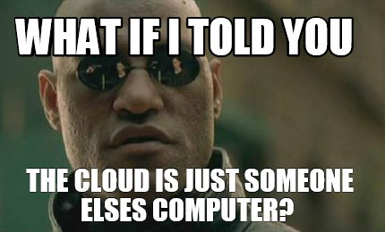

# FIRST STEPS IN THE CLOUD

Before we begin, a brief recap of the `cloud native` world.  
 
What is the cloud?  
The Cloud is a new IT paradigm.
 
 
Basically it focuses on reducing the operative burden of managing infrastructure by outsurcing it.

When we talk about **cloud native** we mean applications and flows that leverage this paradigm.

As we have seen before, [Kubernetes](https://kubernetes.io/)(*k8s*) is considered the *De Facto* "Operative system" of the cloud.  
For this tutorial we are going to spin up a local *k8s* cluster with [Minikube](https://minikube.sigs.k8s.io/docs/).

 

Continue to [CI/CD Pipelines](02-cicd-pipelines.md).
