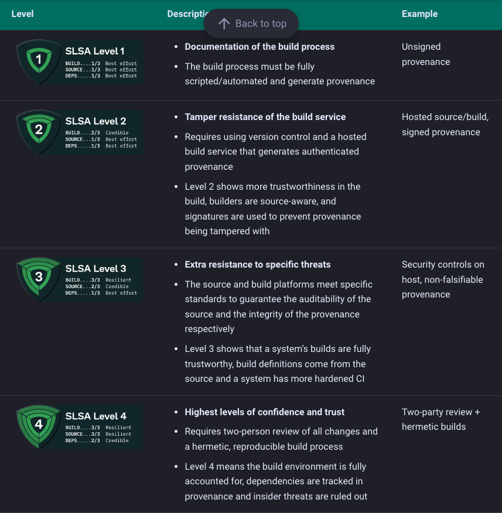

## SLSA Framework


As we have previously see, one of the pipeline tasks sign the builded container image with [cosign](https://docs.sigstore.dev/cosign/overview/).  
For the sake of semplicity we created a custom task definition for that but one can also leverage [Tekton Chains](https://tekton.dev/docs/chains/).

> Tekton Chains is tekton component that implements parts of the [SLSA](https://slsa.dev/) security framework's specifications.  
> In the most basic terms, *SLSA* is a security framework designed to help organizations improve the integrity of their software supply chains.  
> *SLSA* is organized by levels, where each level represents incremental progress from the previous.  
> The higher the level, the more confidence that the software process hasn’t been tampered with.  



Now we need to generate cosign keys (this will also ask for a password to protect the private key):
```console
cosign generate-key-pair k8s://tekton-chains/signing-secrets
```  

Output:
```console
Enter password for private key: 
Enter password for private key again: 
Successfully created secret signing-secrets in namespace tekton-chains
Public key written to cosign.pub
```  


Continue to [RBAC](07-rbac.md)
