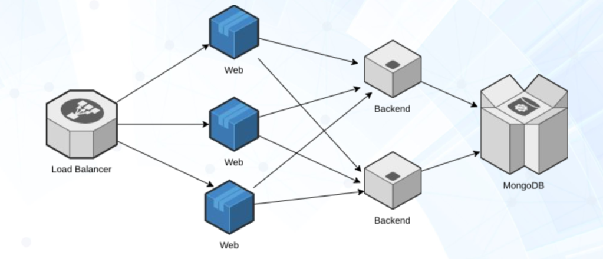

# PowerApp by [SIGHUP](https://sighup.io)

This is PowerApp, a learning-friendly application used by [SIGHUP](https://sighup.io) during the delivery of many of its workshops. The goal of this application is to provide a simple-yet-realistic standard architecture to use as a starting point during our trainings and workshops.

If you are looking for Kubernetes professional trainings or workshops, [email us](mailto:training@sighup.io).

## Architecture

The current application has a multi-tiered architecture with standard `frontend <-> backend <-> db`.




## docker-compose

To run the PowerApp with `docker-compose` execute

```bash
# Build the kubeprimer-web and kubeprimer-backed containers images
make build
# Run the services
make run
```

The services can be scaled with

```bash
docker-compose up scale frontend=3 backend=2
```